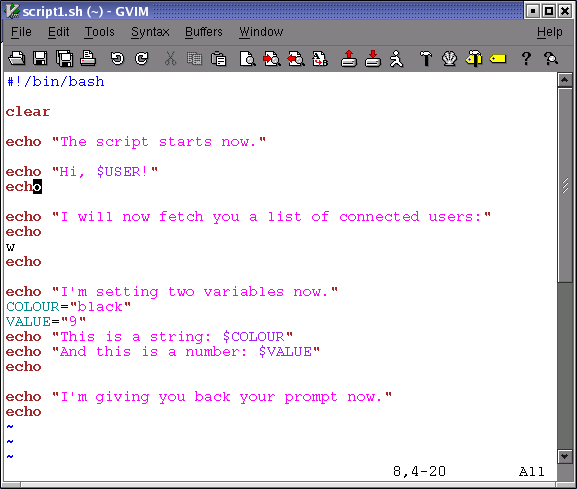

::: {.NAVHEADER}
Bash Guide for Beginners
:::

[Prev](chap_02.md)

Chapter 2. Writing and debugging scripts

[Next](sect_02_02.md)

------------------------------------------------------------------------

::: {.sect1}
[]{#sect_02_01}2.1. Creating and running a script {#creating-and-running-a-script .sect1}
=================================================

::: {.sect2}
[]{#sect_02_01_01}2.1.1. Writing and naming {#writing-and-naming .sect2}
-------------------------------------------

A shell script is a sequence of commands for which you have a repeated
use. This sequence is typically executed by entering the name of the
script on the command line. Alternatively, you can use scripts to
automate tasks using the cron facility. Another use for scripts is in
the UNIX boot and shutdown procedure, where operation of daemons and
services are defined in init scripts.

To create a shell script, open a new empty file in your editor. Any text
editor will do: **vim**, **emacs**, **gedit**, **dtpad** et cetera are
all valid. You might want to chose a more advanced editor like **vim**
or **emacs**, however, because these can be configured to recognize
shell and Bash syntax and can be a great help in preventing those errors
that beginners frequently make, such as forgetting brackets and
semi-colons.

::: {.tip}
+-----------------------------------+-----------------------------------+
|     |                                   |
+-----------------------------------+-----------------------------------+
|                                   | In order to activate syntax       |
|                                   | highlighting in **vim**, use the  |
|                                   | command                           |
|                                   |                                   |
|                                   | **:syntax enable**                |
|                                   |                                   |
|                                   | or                                |
|                                   |                                   |
|                                   | **:sy enable**                    |
|                                   |                                   |
|                                   | or                                |
|                                   |                                   |
|                                   | **:syn enable**                   |
|                                   |                                   |
|                                   | You can add this setting to your  |
|                                   | `.vimrc`{.filename} file to make  |
|                                   | it permanent.                     |
+-----------------------------------+-----------------------------------+
:::

Put UNIX commands in the new empty file, like you would enter them on
the command line. As discussed in the previous chapter (see [Section
1.3](sect_01_03.md)), commands can be shell functions, shell
built-ins, UNIX commands and other scripts.

Give your script a sensible name that gives a hint about what the script
does. Make sure that your script name does not conflict with existing
commands. In order to ensure that no confusion can rise, script names
often end in `.sh`{.filename}; even so, there might be other scripts on
your system with the same name as the one you chose. Check using
**which**, **whereis** and other commands for finding information about
programs and files:

**which `-a`{.option} `script_name`{.filename}**

**whereis `script_name`{.filename}**

**locate `script_name`{.filename}**
:::

::: {.sect2}
[]{#sect_02_01_02}2.1.2. script1.sh {#script1.sh .sect2}
-----------------------------------

In this example we use the **echo** Bash built-in to inform the user
about what is going to happen, before the task that will create the
output is executed. It is strongly advised to inform users about what a
script is doing, in order to prevent them from becoming nervous *because
the script is not doing anything*. We will return to the subject of
notifying users in [Chapter 8](chap_08.md).

::: {.figure}
[]{#AEN1409}

**Figure 2-1. script1.sh**

::: {.mediaobject}

:::
:::

Write this script for yourself as well. It might be a good idea to
create a directory `~/scripts`{.filename} to hold your scripts. Add the
directory to the contents of the `PATH`{.varname} variable:

**export `PATH`{.varname}=\"`$PATH`{.varname}:`~/scripts`{.filename}\"**

If you are just getting started with Bash, use a text editor that uses
different colours for different shell constructs. Syntax highlighting is
supported by **vim**, **gvim**, **(x)emacs**, **kwrite** and many other
editors; check the documentation of your favorite editor.

::: {.note}
+-----------------------------------+-----------------------------------+
|   |                                   |
+-----------------------------------+-----------------------------------+
|                                   | The prompts throughout this       |
|                                   | course vary depending on the      |
|                                   | author\'s mood. This resembles    |
|                                   | much more real life situations    |
|                                   | than the standard educational     |
|                                   | *\$* prompt. The only convention  |
|                                   | we stick to, is that the *root*   |
|                                   | prompt ends in a hash mark (\#).  |
+-----------------------------------+-----------------------------------+
:::
:::

::: {.sect2}
[]{#sect_02_01_03}2.1.3. Executing the script {#executing-the-script .sect2}
---------------------------------------------

The script should have execute permissions for the correct owners in
order to be runnable. When setting permissions, check that you really
obtained the permissions that you want. When this is done, the script
can run like any other command:

+-----------------------------------------------------------------------+
| ``` {.screen}                                                         |
| 
willy:~/scripts> chmod u+x script1.sh                                |
|                                                                       |
| willy:~/scripts> ls -l script1.sh                                     |
| -rwxrw-r--    1 willy   willy       456 Dec 24 17:11 script1.sh       |
|                                                                       |
| willy:~> script1.sh                                                   |
| The script starts now.                                                |
| Hi, willy!                                                            |
|                                                                       |
| I will now fetch you a list of connected users:                       |
|                                                                       |
|   3:38pm  up 18 days,  5:37,  4 users,  load average: 0.12, 0.22, 0.1 |
| 5                                                                     |
| USER     TTY      FROM              LOGIN@   IDLE   JCPU   PCPU  WHAT |
| root     tty2     -                Sat 2pm  4:25m  0.24s  0.05s  -bas |
| h                                                                     |
| willy    :0       -                Sat 2pm   ?     0.00s   ?     -    |
| willy    pts/3    -                Sat 2pm  3:33m 36.39s 36.39s  Bitc |
| hX willy ir                                                           |
| willy    pts/2    -                Sat 2pm  3:33m  0.13s  0.06s  /usr |
| /bin/screen                                                           |
|                                                                       |
| I'm setting two variables now.                                        |
| This is a string: black                                               |
| And this is a number: 9                                               |
|                                                                       |
| I'm giving you back your prompt now.                                  |
|                                                                       |
| willy:~/scripts> echo $COLOUR                                         |
|                                                                       |
| willy:~/scripts> echo $VALUE                                          |
|                                                                       |
| willy:~/scripts>                                                      |
| ```                                                                   |
+-----------------------------------------------------------------------+

This is the most common way to execute a script. It is preferred to
execute the script like this in a subshell. The variables, functions and
aliases created in this subshell are only known to the particular bash
session of that subshell. When that shell exits and the parent regains
control, everything is cleaned up and all changes to the state of the
shell made by the script, are forgotten.

If you did not put the `scripts`{.filename} directory in your
`PATH`{.varname}, and `.`{.filename} (the current directory) is not in
the `PATH`{.varname} either, you can activate the script like this:

**./script\_name.sh**

A script can also explicitly be executed by a given shell, but generally
we only do this if we want to obtain special behavior, such as checking
if the script works with another shell or printing traces for debugging:

**rbash `script_name.sh`{.filename}**

**sh `script_name.sh`{.filename}**

**bash `-x`{.option} `script_name.sh`{.filename}**

The specified shell will start as a subshell of your current shell and
execute the script. This is done when you want the script to start up
with specific options or under specific conditions which are not
specified in the script.

If you don\'t want to start a new shell but execute the script in the
current shell, you *source* it:

**source `script_name.sh`{.filename}**

::: {.tip}
+-----------------------------------+-----------------------------------+
|     |                                   |
+-----------------------------------+-----------------------------------+
|                                   | The Bash **source** built-in is a |
|                                   | synonym for the Bourne shell      |
|                                   | **.** (dot) command.              |
+-----------------------------------+-----------------------------------+
:::

The script does not need execute permission in this case. Commands are
executed in the current shell context, so any changes made to your
environment will be visible when the script finishes execution:

+-----------------------------------------------------------------------+
| ``` {.screen}                                                         |
| 
willy:~/scripts> source script1.sh                                   |
| --output ommitted--                                                   |
|                                                                       |
| willy:~/scripts> echo $VALUE                                          |
| 9                                                                     |
|                                                                       |
| willy:~/scripts>                                                      |
| ```                                                                   |
+-----------------------------------------------------------------------+
:::
:::

::: {.NAVFOOTER}

------------------------------------------------------------------------

  ------------------------------- -------------------- -------------------------
  [Prev](chap_02.md)             [Home](index.md)    [Next](sect_02_02.md)
  Writing and debugging scripts    [Up](chap_02.md)              Script basics
  ------------------------------- -------------------- -------------------------
:::
