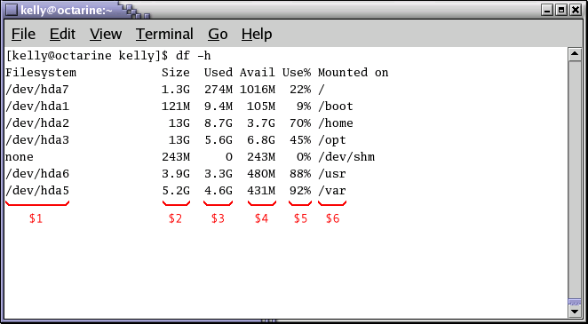

::: {.NAVHEADER}
Bash Guide for Beginners
:::

[Prev](sect_06_01.md)

Chapter 6. The GNU awk programming language

[Next](sect_06_03.md)

------------------------------------------------------------------------

::: {.sect1}
[]{#sect_06_02}6.2. The print program {#the-print-program .sect1}
=====================================

::: {.sect2}
[]{#sect_06_02_01}6.2.1. Printing selected fields {#printing-selected-fields .sect2}
-------------------------------------------------

The **print** command in **awk** outputs selected data from the input
file.

When **awk** reads a line of a file, it divides the line in fields based
on the specified *input field separator*, `FS`{.varname}, which is an
**awk** variable (see [Section 6.3.2](sect_06_03.md#sect_06_03_02)).
This variable is predefined to be one or more spaces or tabs.

The variables `$1`{.varname}, `$2`{.varname}, `$3`{.varname}, \...,
`$N`{.varname} hold the values of the first, second, third until the
last field of an input line. The variable `$0`{.varname} (zero) holds
the value of the entire line. This is depicted in the image below, where
we see six colums in the output of the **df** command:

::: {.figure}
[]{#AEN4111}

**Figure 6-1. Fields in awk**

::: {.mediaobject}

:::
:::

In the output of **ls `-l`{.option}**, there are 9 columns. The
**print** statement uses these fields as follows:

+-----------------------------------------------------------------------+
| ``` {.screen}                                                         |
| 
kelly@octarine ~/test> ls -l | awk '{ print $5 $9 }'                 |
| 160orig                                                               |
| 121script.sed                                                         |
| 120temp_file                                                          |
| 126test                                                               |
| 120twolines                                                           |
| 441txt2html.sh                                                        |
|                                                                       |
| kelly@octarine ~/test>                                                |
| ```                                                                   |
+-----------------------------------------------------------------------+

This command printed the fifth column of a long file listing, which
contains the file size, and the last column, the name of the file. This
output is not very readable unless you use the official way of referring
to columns, which is to separate the ones that you want to print with a
comma. In that case, the default output separater character, usually a
space, will be put in between each output field.

::: {.note}
+-----------------------------------+-----------------------------------+
|   |                                   |
+-----------------------------------+-----------------------------------+
|                                   | Note that the configuration of    |
|                                   | the output of the **ls            |
|                                   | `-l`{.option}** command might be  |
|                                   | different on your system. Display |
|                                   | of time and date is dependent on  |
|                                   | your locale setting.              |
+-----------------------------------+-----------------------------------+
:::
:::

::: {.sect2}
[]{#sect_06_02_02}6.2.2. Formatting fields {#formatting-fields .sect2}
------------------------------------------

Without formatting, using only the output separator, the output looks
rather poor. Inserting a couple of tabs and a string to indicate what
output this is will make it look a lot better:

+-----------------------------------------------------------------------+
| ``` {.screen}                                                         |
| 
kelly@octarine ~/test> ls -ldh * | grep -v total | \                 |
| awk '{ print "Size is " $5 " bytes for " $9 }'                        |
| Size is 160 bytes for orig                                            |
| Size is 121 bytes for script.sed                                      |
| Size is 120 bytes for temp_file                                       |
| Size is 126 bytes for test                                            |
| Size is 120 bytes for twolines                                        |
| Size is 441 bytes for txt2html.sh                                     |
|                                                                       |
| kelly@octarine ~/test>                                                |
| ```                                                                   |
+-----------------------------------------------------------------------+

Note the use of the backslash, which makes long input continue on the
next line without the shell interpreting this as a separate command.
While your command line input can be of virtually unlimited length, your
monitor is not, and printed paper certainly isn\'t. Using the backslash
also allows for copying and pasting of the above lines into a terminal
window.

The `-h`{.option} option to **ls** is used for supplying humanly
readable size formats for bigger files. The output of a long listing
displaying the total amount of blocks in the directory is given when a
directory is the argument. This line is useless to us, so we add an
asterisk. We also add the `-d`{.option} option for the same reason, in
case asterisk expands to a directory.

The backslash in this example marks the continuation of a line. See
[Section 3.3.2](sect_03_03.md#sect_03_03_02).

You can take out any number of columns and even reverse the order. In
the example below this is demonstrated for showing the most critical
partitions:

+-----------------------------------------------------------------------+
| ``` {.screen}                                                         |
| 
kelly@octarine ~> df -h | sort -rnk 5 | head -3 | \                  |
| awk '{ print "Partition " $6 "\t: " $5 " full!" }'                    |
| Partition /var  : 86% full!                                           |
| Partition /usr  : 85% full!                                           |
| Partition /home : 70% full!                                           |
|                                                                       |
| kelly@octarine ~>                                                     |
| ```                                                                   |
+-----------------------------------------------------------------------+

The table below gives an overview of special formatting characters:

::: {.table}
[]{#tab_06_01}

**Table 6-1. Formatting characters for gawk**

  Sequence   Meaning
  ---------- -------------------
  \\a        Bell character
  \\n        Newline character
  \\t        Tab
:::

Quotes, dollar signs and other meta-characters should be escaped with a
backslash.
:::

::: {.sect2}
[]{#sect_06_02_03}6.2.3. The print command and regular expressions {#the-print-command-and-regular-expressions .sect2}
------------------------------------------------------------------

A regular expression can be used as a pattern by enclosing it in
slashes. The regular expression is then tested against the entire text
of each record. The syntax is as follows:

**awk \'EXPRESSION { PROGRAM }\' `file(s)`{.filename}**

The following example displays only local disk device information,
networked file systems are not shown:

+-----------------------------------------------------------------------+
| ``` {.screen}                                                         |
| 
kelly is in ~> df -h | awk '/dev\/hd/ { print $6 "\t: " $5 }'        |
| /       : 46%                                                         |
| /boot   : 10%                                                         |
| /opt    : 84%                                                         |
| /usr    : 97%                                                         |
| /var    : 73%                                                         |
| /.vol1  : 8%                                                          |
|                                                                       |
| kelly is in ~>                                                        |
| ```                                                                   |
+-----------------------------------------------------------------------+

Slashes need to be escaped, because they have a special meaning to the
**awk** program.

Below another example where we search the `/etc`{.filename} directory
for files ending in [\".conf\"]{.QUOTE} and starting with either
[\"a\"]{.QUOTE} *or* [\"x\"]{.QUOTE}, using extended regular
expressions:

+-----------------------------------------------------------------------+
| ``` {.screen}                                                         |
| 
kelly is in /etc> ls -l | awk '/\<(a|x).*\.conf$/ { print $9 }'      |
| amd.conf                                                              |
| antivir.conf                                                          |
| xcdroast.conf                                                         |
| xinetd.conf                                                           |
|                                                                       |
| kelly is in /etc>                                                     |
| ```                                                                   |
+-----------------------------------------------------------------------+

This example illustrates the special meaning of the dot in regular
expressions: the first one indicates that we want to search for any
character after the first search string, the second is escaped because
it is part of a string to find (the end of the file name).
:::

::: {.sect2}
[]{#sect_06_02_04}6.2.4. Special patterns {#special-patterns .sect2}
-----------------------------------------

In order to precede output with comments, use the **BEGIN** statement:

+-----------------------------------------------------------------------+
| ``` {.screen}                                                         |
| 
kelly is in /etc> ls -l | \                                          |
| awk 'BEGIN { print "Files found:\n" } /\<[a|x].*\.conf$/ { print $9 } |
| '                                                                     |
| Files found:                                                          |
| amd.conf                                                              |
| antivir.conf                                                          |
| xcdroast.conf                                                         |
| xinetd.conf                                                           |
|                                                                       |
| kelly is in /etc>                                                     |
| ```                                                                   |
+-----------------------------------------------------------------------+

The **END** statement can be added for inserting text after the entire
input is processed:

+-----------------------------------------------------------------------+
| ``` {.screen}                                                         |
| 
kelly is in /etc> ls -l | \                                          |
| awk '/\<[a|x].*\.conf$/ { print $9 } END { print \                    |
| "Can I do anything else for you, mistress?" }'                        |
| amd.conf                                                              |
| antivir.conf                                                          |
| xcdroast.conf                                                         |
| xinetd.conf                                                           |
| Can I do anything else for you, mistress?                             |
|                                                                       |
| kelly is in /etc>                                                     |
| ```                                                                   |
+-----------------------------------------------------------------------+
:::

::: {.sect2}
[]{#sect_06_02_05}6.2.5. Gawk scripts {#gawk-scripts .sect2}
-------------------------------------

As commands tend to get a little longer, you might want to put them in a
script, so they are reusable. An **awk** script contains **awk**
statements defining patterns and actions.

As an illustration, we will build a report that displays our most loaded
partitions. See [Section 6.2.2](sect_06_02.md#sect_06_02_02).

+-----------------------------------------------------------------------+
| ``` {.screen}                                                         |
| 
kelly is in ~> cat diskrep.awk                                       |
| BEGIN { print "*** WARNING WARNING WARNING ***" }                     |
| /\<[8|9][0-9]%/ { print "Partition " $6 "\t: " $5 " full!" }          |
| END { print "*** Give money for new disks URGENTLY! ***" }            |
|                                                                       |
| kelly is in ~> df -h | awk -f diskrep.awk                             |
| *** WARNING WARNING WARNING ***                                       |
| Partition /usr  : 97% full!                                           |
| *** Give money for new disks URGENTLY! ***                            |
|                                                                       |
| kelly is in ~>                                                        |
| ```                                                                   |
+-----------------------------------------------------------------------+

**awk** first prints a begin message, then formats all the lines that
contain an eight or a nine at the beginning of a word, followed by one
other number and a percentage sign. An end message is added.

::: {.note}
+-----------------------------------+-----------------------------------+
|   |                                   |
+-----------------------------------+-----------------------------------+
|                                   | Awk is a programming language.    |
|                                   | Its syntax is recognized by most  |
|                                   | editors that can do syntax        |
|                                   | highlighting for other languages, |
|                                   | such as C, Bash, HTML, etc.       |
+-----------------------------------+-----------------------------------+
:::
:::
:::

::: {.NAVFOOTER}

------------------------------------------------------------------------

  --------------------------- -------------------- -------------------------
  [Prev](sect_06_01.md)      [Home](index.md)    [Next](sect_06_03.md)
  Getting started with gawk    [Up](chap_06.md)             Gawk variables
  --------------------------- -------------------- -------------------------
:::
