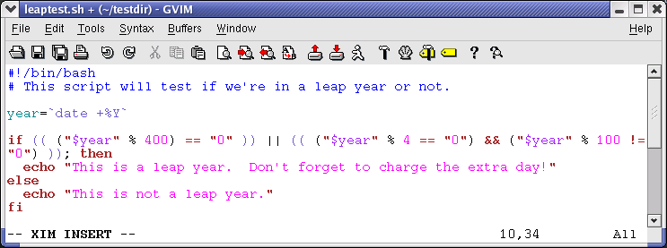

::: {.NAVHEADER}
Bash Guide for Beginners
:::

[Prev](sect_07_01.md)

Chapter 7. Conditional statements

[Next](sect_07_03.md)

------------------------------------------------------------------------

::: {.sect1}
[]{#sect_07_02}7.2. More advanced if usage {#more-advanced-if-usage .sect1}
==========================================

::: {.sect2}
[]{#sect_07_02_01}7.2.1. if/then/else constructs {#ifthenelse-constructs .sect2}
------------------------------------------------

::: {.sect3}
### []{#sect_07_02_01_01}7.2.1.1. Dummy example {#dummy-example .sect3}

This is the construct to use to take one course of action if the **if**
commands test true, and another if it tests false. An example:

+-----------------------------------------------------------------------+
| ``` {.screen}                                                         |
| 
freddy scripts> gender="male"                                        |
|                                                                       |
| freddy scripts> if [[ "$gender" == "f*" ]]                            |
| More input> then echo "Pleasure to meet you, Madame."                 |
| More input> else echo "How come the lady hasn't got a drink yet?"     |
| More input> fi                                                        |
| How come the lady hasn't got a drink yet?                             |
|                                                                       |
| freddy scripts>                                                       |
| ```                                                                   |
+-----------------------------------------------------------------------+

::: {.important}
+-----------------------------------+-----------------------------------+
|                          |                                   |
+-----------------------------------+-----------------------------------+
|                                   | Contrary to `[`{.parameter},      |
|                                   | `[[`{.parameter} prevents word    |
|                                   | splitting of variable values. So, |
|                                   | if                                |
|                                   | `VAR="var with spaces"`{.varname} |
|                                   | ,                                 |
|                                   | you do not need to double quote   |
|                                   | `$VAR`{.varname} in a test -      |
|                                   | eventhough using quotes remains a |
|                                   | good habit. Also,                 |
|                                   | `[[`{.parameter} prevents         |
|                                   | pathname expansion, so literal    |
|                                   | strings with wildcards do not try |
|                                   | to expand to filenames. Using     |
|                                   | `[[`{.parameter},                 |
|                                   | `==`{.parameter} and              |
|                                   | `!=`{.parameter} interpret        |
|                                   | strings to the right as shell     |
|                                   | glob patterns to be matched       |
|                                   | against the value to the left,    |
|                                   | for instance:                     |
|                                   | `[[ "value" == val* ]]`{.paramete |
|                                   | r}.                               |
+-----------------------------------+-----------------------------------+
:::

Like the **CONSEQUENT-COMMANDS** list following the **then** statement,
the **ALTERNATE-CONSEQUENT-COMMANDS** list following the **else**
statement can hold any UNIX-style command that returns an exit status.

Another example, extending the one from [Section
7.1.2.1](sect_07_01.md#sect_07_01_02_01):

+-----------------------------------------------------------------------+
| ``` {.screen}                                                         |
| 
anny ~> su -                                                         |
| Password:                                                             |
| [root@elegance root]# if ! grep ^$USER /etc/passwd 1> /dev/null       |
| > then echo "your user account is not managed locally"                |
| > else echo "your account is managed from the local /etc/passwd file" |
| > fi                                                                  |
| your account is managed from the local /etc/passwd file               |
| [root@elegance root]#                                                 |
| ```                                                                   |
+-----------------------------------------------------------------------+

We switch to the *root* account to demonstrate the effect of the
**else** statement - your *root* is usually a local account while your
own user account might be managed by a central system, such as an LDAP
server.
:::

::: {.sect3}
### []{#sect_07_02_01_02}7.2.1.2. Checking command line arguments {#checking-command-line-arguments .sect3}

Instead of setting a variable and then executing a script, it is
frequently more elegant to put the values for the variables on the
command line.

We use the positional parameters `$1`{.varname}, `$2`{.varname}, \...,
`$N`{.varname} for this purpose. `$#`{.varname} refers to the number of
command line arguments. `$0`{.varname} refers to the name of the script.

The following is a simple example:

::: {.figure}
[]{#AEN5029}

**Figure 7-1. Testing of a command line argument with if**

::: {.mediaobject}

:::
:::

Here\'s another example, using two arguments:

+-----------------------------------------------------------------------+
| ``` {.screen}                                                         |
| 
anny ~> cat weight.sh                                                |
| #!/bin/bash                                                           |
|                                                                       |
| # This script prints a message about your weight if you give it your  |
| # weight in kilos and height in centimeters.                          |
|                                                                       |
| weight="$1"                                                           |
| height="$2"                                                           |
| idealweight=$[$height - 110]                                          |
|                                                                       |
| if [ $weight -le $idealweight ] ; then                                |
|   echo "You should eat a bit more fat."                               |
| else                                                                  |
|   echo "You should eat a bit more fruit."                             |
| fi                                                                    |
|                                                                       |
| anny ~> bash -x weight.sh 55 169                                      |
| + weight=55                                                           |
| + height=169                                                          |
| + idealweight=59                                                      |
| + '[' 55 -le 59 ']'                                                   |
| + echo 'You should eat a bit more fat.'                               |
| You should eat a bit more fat.                                        |
| ```                                                                   |
+-----------------------------------------------------------------------+
:::

::: {.sect3}
### []{#sect_07_02_01_03}7.2.1.3. Testing the number of arguments {#testing-the-number-of-arguments .sect3}

The following example shows how to change the previous script so that it
prints a message if more or less than 2 arguments are given:

+-----------------------------------------------------------------------+
| ``` {.screen}                                                         |
| 
anny ~> cat weight.sh                                                |
| #!/bin/bash                                                           |
|                                                                       |
| # This script prints a message about your weight if you give it your  |
| # weight in kilos and height in centimeters.                          |
|                                                                       |
| if [ ! $# == 2 ]; then                                                |
|   echo "Usage: $0 weight_in_kilos length_in_centimeters"              |
|   exit                                                                |
| fi                                                                    |
|                                                                       |
| weight="$1"                                                           |
| height="$2"                                                           |
| idealweight=$[$height - 110]                                          |
|                                                                       |
| if [ $weight -le $idealweight ] ; then                                |
|   echo "You should eat a bit more fat."                               |
| else                                                                  |
|   echo "You should eat a bit more fruit."                             |
| fi                                                                    |
|                                                                       |
| anny ~> weight.sh 70 150                                              |
| You should eat a bit more fruit.                                      |
|                                                                       |
| anny ~> weight.sh 70 150 33                                           |
| Usage: ./weight.sh weight_in_kilos length_in_centimeters              |
| ```                                                                   |
+-----------------------------------------------------------------------+

The first argument is referred to as `$1`{.varname}, the second as
`$2`{.varname} and so on. The total number of arguments is stored in
`$#`{.varname}.

Check out [Section 7.2.5](sect_07_02.md#sect_07_02_05) for a more
elegant way to print usage messages.
:::

::: {.sect3}
### []{#sect_07_02_01_04}7.2.1.4. Testing that a file exists {#testing-that-a-file-exists .sect3}

This test is done in a lot of scripts, because there\'s no use in
starting a lot of programs if you know they\'re not going to work:

+-----------------------------------------------------------------------+
| ``` {.screen}                                                         |
| 
#!/bin/bash                                                          |
|                                                                       |
| # This script gives information about a file.                         |
|                                                                       |
| FILENAME="$1"                                                         |
|                                                                       |
| echo "Properties for $FILENAME:"                                      |
|                                                                       |
| if [ -f $FILENAME ]; then                                             |
|   echo "Size is $(ls -lh $FILENAME | awk '{ print $5 }')"             |
|   echo "Type is $(file $FILENAME | cut -d":" -f2 -)"                  |
|   echo "Inode number is $(ls -i $FILENAME | cut -d" " -f1 -)"         |
|   echo "$(df -h $FILENAME | grep -v Mounted | awk '{ print "On",$1",  |
| \                                                                     |
| which is mounted as the",$6,"partition."}')"                          |
| else                                                                  |
|   echo "File does not exist."                                         |
| fi                                                                    |
| ```                                                                   |
+-----------------------------------------------------------------------+

Note that the file is referred to using a variable; in this case it is
the first argument to the script. Alternatively, when no arguments are
given, file locations are usually stored in variables at the beginning
of a script, and their content is referred to using these variables.
Thus, when you want to change a file name in a script, you only need to
do it once.

::: {.tip}
+-----------------------------------+-----------------------------------+
|     |                                   |
+-----------------------------------+-----------------------------------+
|                                   | The above example will fail if    |
|                                   | the value of `$1`{.varname} can   |
|                                   | be parsed as multiple words. In   |
|                                   | that case, the **if** command can |
|                                   | be fixed either using double      |
|                                   | quotes around the filename, or by |
|                                   | using `[[`{.parameter} instead of |
|                                   | `[`{.parameter}.                  |
+-----------------------------------+-----------------------------------+
:::
:::
:::

::: {.sect2}
[]{#sect_07_02_02}7.2.2. if/then/elif/else constructs {#ifthenelifelse-constructs .sect2}
-----------------------------------------------------

::: {.sect3}
### []{#sect_07_02_02_01}7.2.2.1. General {#general .sect3}

This is the full form of the **if** statement:

**if TEST-COMMANDS; then**

**CONSEQUENT-COMMANDS;**

**elif MORE-TEST-COMMANDS; then**

**MORE-CONSEQUENT-COMMANDS;**

**else ALTERNATE-CONSEQUENT-COMMANDS;**

**fi**

The **TEST-COMMANDS** list is executed, and if its return status is
zero, the **CONSEQUENT-COMMANDS** list is executed. If **TEST-COMMANDS**
returns a non-zero status, each **elif** list is executed in turn, and
if its exit status is zero, the corresponding
**MORE-CONSEQUENT-COMMANDS** is executed and the command completes. If
**else** is followed by an **ALTERNATE-CONSEQUENT-COMMANDS** list, and
the final command in the final **if** or **elif** clause has a non-zero
exit status, then **ALTERNATE-CONSEQUENT-COMMANDS** is executed. The
return status is the exit status of the last command executed, or zero
if no condition tested true.
:::

::: {.sect3}
### []{#sect_07_02_02_02}7.2.2.2. Example {#example .sect3}

This is an example that you can put in your crontab for daily execution:

+-----------------------------------------------------------------------+
| ``` {.screen}                                                         |
| 
anny /etc/cron.daily> cat disktest.sh                                |
| #!/bin/bash                                                           |
|                                                                       |
| # This script does a very simple test for checking disk space.        |
|                                                                       |
| space=`df -h | awk '{print $5}' | grep % | grep -v Use | sort -n | ta |
| il -1 | cut -d "%" -f1 -`                                             |
| alertvalue="80"                                                       |
|                                                                       |
| if [ "$space" -ge "$alertvalue" ]; then                               |
|   echo "At least one of my disks is nearly full!" | mail -s "daily di |
| skcheck" root                                                         |
| else                                                                  |
|   echo "Disk space normal" | mail -s "daily diskcheck" root           |
| fi                                                                    |
| ```                                                                   |
+-----------------------------------------------------------------------+
:::
:::

::: {.sect2}
[]{#sect_07_02_03}7.2.3. Nested if statements {#nested-if-statements .sect2}
---------------------------------------------

Inside the **if** statement, you can use another **if** statement. You
may use as many levels of nested **if**s as you can logically manage.

This is an example testing leap years:

+-----------------------------------------------------------------------+
| ``` {.screen}                                                         |
| 
anny ~/testdir> cat testleap.sh                                      |
| #!/bin/bash                                                           |
| # This script will test if we're in a leap year or not.               |
|                                                                       |
| year=`date +%Y`                                                       |
|                                                                       |
| if [ $[$year % 400] -eq "0" ]; then                                   |
|   echo "This is a leap year.  February has 29 days."                  |
| elif [ $[$year % 4] -eq 0 ]; then                                     |
|         if [ $[$year % 100] -ne 0 ]; then                             |
|           echo "This is a leap year, February has 29 days."           |
|         else                                                          |
|           echo "This is not a leap year.  February has 28 days."      |
|         fi                                                            |
| else                                                                  |
|   echo "This is not a leap year.  February has 28 days."              |
| fi                                                                    |
|                                                                       |
| anny ~/testdir> date                                                  |
| Tue Jan 14 20:37:55 CET 2003                                          |
|                                                                       |
| anny ~/testdir> testleap.sh                                           |
| This is not a leap year.                                              |
| ```                                                                   |
+-----------------------------------------------------------------------+
:::

::: {.sect2}
[]{#sect_07_02_04}7.2.4. Boolean operations {#boolean-operations .sect2}
-------------------------------------------

The above script can be shortened using the Boolean operators
[\"AND\"]{.QUOTE} (&&) and [\"OR\"]{.QUOTE} (\|\|).

::: {.figure}
[]{#AEN5144}

**Figure 7-2. Example using Boolean operators**

::: {.mediaobject}

:::
:::

We use the double brackets for testing an arithmetic expression, see
[Section 3.4.6](sect_03_04.md#sect_03_04_05). This is equivalent to
the **let** statement. You will get stuck using square brackets here, if
you try something like **\$\[\$year % 400\]**, because here, the square
brackets don\'t represent an actual command by themselves.

Among other editors, **gvim** is one of those supporting colour schemes
according to the file format; such editors are useful for detecting
errors in your code.
:::

::: {.sect2}
[]{#sect_07_02_05}7.2.5. Using the exit statement and if {#using-the-exit-statement-and-if .sect2}
--------------------------------------------------------

We already briefly met the **exit** statement in [Section
7.2.1.3](sect_07_02.md#sect_07_02_01_03). It terminates execution of
the entire script. It is most often used if the input requested from the
user is incorrect, if a statement did not run successfully or if some
other error occurred.

The **exit** statement takes an optional argument. This argument is the
integer exit status code, which is passed back to the parent and stored
in the `$?`{.varname} variable.

A zero argument means that the script ran successfully. Any other value
may be used by programmers to pass back different messages to the
parent, so that different actions can be taken according to failure or
success of the child process. If no argument is given to the **exit**
command, the parent shell uses the current value of the `$?`{.varname}
variable.

Below is an example with a slightly adapted `penguin.sh`{.filename}
script, which sends its exit status back to the parent,
`feed.sh`{.filename}:

+-----------------------------------------------------------------------+
| ``` {.screen}                                                         |
| 
anny ~/testdir> cat penguin.sh                                       |
| #!/bin/bash                                                           |
|                                                                       |
|                                                                       |
| # This script lets you present different menus to Tux.  He will only  |
| be happy                                                              |
| # when given a fish.  We've also added a dolphin and (presumably) a c |
| amel.                                                                 |
|                                                                       |
|                                                                       |
| if [ "$menu" == "fish" ]; then                                        |
|   if [ "$animal" == "penguin" ]; then                                 |
|     echo "Hmmmmmm fish... Tux happy!"                                 |
|   elif [ "$animal" == "dolphin" ]; then                               |
|     echo "Pweetpeettreetppeterdepweet!"                               |
|   else                                                                |
|     echo "*prrrrrrrt*"                                                |
|   fi                                                                  |
| else                                                                  |
|   if [ "$animal" == "penguin" ]; then                                 |
|     echo "Tux don't like that.  Tux wants fish!"                      |
|     exit 1                                                            |
|   elif [ "$animal" == "dolphin" ]; then                               |
|     echo "Pweepwishpeeterdepweet!"                                    |
|     exit 2                                                            |
|   else                                                                |
|     echo "Will you read this sign?!"                                  |
|     exit 3                                                            |
|   fi                                                                  |
| fi                                                                    |
| ```                                                                   |
+-----------------------------------------------------------------------+

This script is called upon in the next one, which therefore exports its
variables `menu`{.varname} and `animal`{.varname}:

+-----------------------------------------------------------------------+
| ``` {.screen}                                                         |
| 
anny ~/testdir> cat feed.sh                                          |
| #!/bin/bash                                                           |
| # This script acts upon the exit status given by penguin.sh           |
|                                                                       |
|                                                                       |
| export menu="$1"                                                      |
| export animal="$2"                                                    |
|                                                                       |
|                                                                       |
| feed="/nethome/anny/testdir/penguin.sh"                               |
|                                                                       |
|                                                                       |
| $feed $menu $animal                                                   |
|                                                                       |
|                                                                       |
| case $? in                                                            |
|                                                                       |
|                                                                       |
| 1)                                                                    |
|   echo "Guard: You'd better give'm a fish, less they get violent..."  |
|   ;;                                                                  |
| 2)                                                                    |
|   echo "Guard: It's because of people like you that they are leaving  |
| earth all the time..."                                                |
|   ;;                                                                  |
| 3)                                                                    |
|   echo "Guard: Buy the food that the Zoo provides for the animals, yo |
| u ***, how                                                            |
| do you think we survive?"                                             |
|   ;;                                                                  |
| *)                                                                    |
|   echo "Guard: Don't forget the guide!"                               |
|   ;;                                                                  |
| esac                                                                  |
|                                                                       |
|                                                                       |
| anny ~/testdir> ./feed.sh apple penguin                               |
| Tux don't like that.  Tux wants fish!                                 |
| Guard: You'd better give'm a fish, less they get violent...           |
| ```                                                                   |
+-----------------------------------------------------------------------+

As you can see, exit status codes can be chosen freely. Existing
commands usually have a series of defined codes; see the programmer\'s
manual for each command for more information.
:::
:::

::: {.NAVFOOTER}

------------------------------------------------------------------------

  ------------------------- -------------------- -------------------------
  [Prev](sect_07_01.md)    [Home](index.md)    [Next](sect_07_03.md)
  Introduction to if         [Up](chap_07.md)      Using case statements
  ------------------------- -------------------- -------------------------
:::
